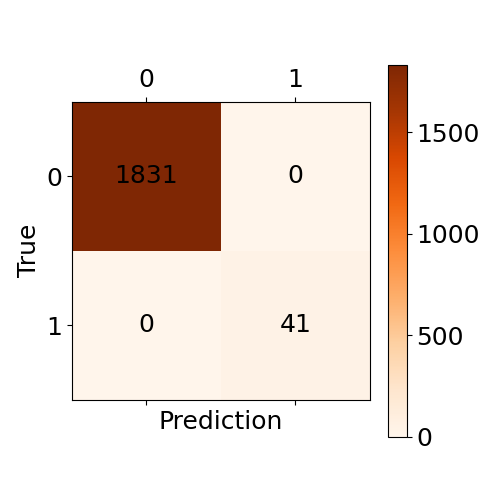
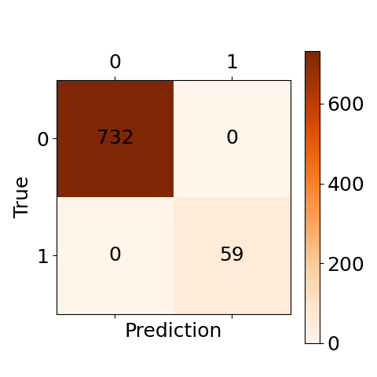
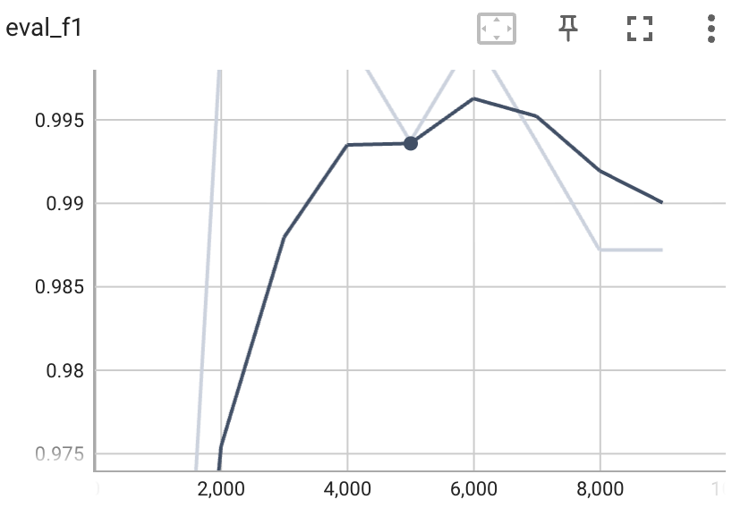
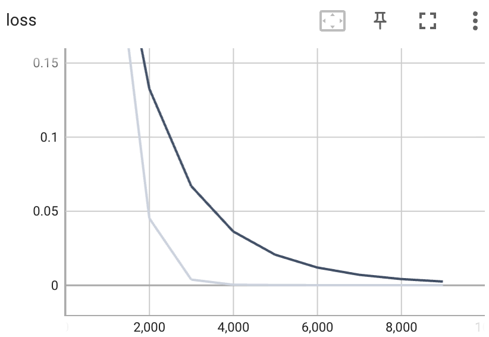

# LucaVirusCress: A Deep Learning Framework for CRESS Virus Identification

[](https://huggingface.co/Daxiao123/LucaVirusCress)
[](https://www.google.com/search?q=https://opensource.org/licenses/MIT)
[](https://www.google.com/search?q=https://www.python.org/downloads/)

**LucaVirusCress** is a specialized binary classification model designed to identify CRESS (Circular Rep-Encoding Single-Stranded) DNA viruses by targeting the **REP (Replication-associated protein)**. Built upon the [LucaProt](https://github.com/alibaba/LucaProt) architecture, this model enables high-throughput automated screening of viral sequences from massive metagenomic datasets.

-----

## 🔬 Project Overview

  - **Task**: Binary Classification (CRESS REP vs. Non-CRESS REP).
  - **Target**: CRESS Virus `REP` proteins.
  - **Architecture**: `SequenceAndStructureFusionNetwork` (SEFN) - a 4-layer Transformer-based fusion network.
  - **Application**: Discovery of novel CRESS viruses in complex environmental or clinical omics data.

-----

## 📊 Training Performance

The model reached optimal convergence at **4,000 global steps**.

### Performance Metrics

The training process utilized a weighted loss to handle extreme class imbalance.

| Metric | Set | Visualization |
| :--- | :--- | :--- |
| **Confusion Matrix** | Test |  |
| **Confusion Matrix** | Dev |  |
| **F1 Score** | Evaluation |  |
| **Training Loss** | Steps |  |

-----

## 🧬 Dataset Details

To ensure high specificity, the model was trained on a highly imbalanced dataset (**1:40 ratio**) with carefully selected "Hard Negatives":

  * **Positive Samples**: Verified CRESS `REP` protein sequences.
  * **Negative Samples**:
    1.  Non-CRESS proteins with high sequence similarity to `REP`.
    2.  Proteins with structural motifs similar to the target class.
    3.  Non-target proteins within the CRESS viral genome (e.g., Cap proteins).

-----

## 💻 Technical Specifications

| Resource | Specification |
| :--- | :--- |
| **Hardware** | NVIDIA L40S (46GB VRAM) |
| **Compute** | 16 vCPUs |
| **Software** | CUDA 12.8 / Driver 570.172.08 |
| **Training Time** | \~20 Hours |

-----

## 🚀 Usage

### 1\. Environment Setup

Clone and install the dependencies from the [LucaProt Official Repository](https://github.com/alibaba/LucaProt).

### 2\. Single Sequence Prediction

To predict a single protein sequence, use the `predict_one_sample.py` script. The embedding matrix is generated in real-time.

```bash
cd LucaProt/src/

python predict_one_sample.py \
    --protein_id protein_1 \
    --sequence MTTSTAFT... (your sequence) \
    --emb_dir ./emb/ \
    --dataset_name cress \
    --dataset_type protein \
    --task_type binary_class \
    --model_type sefn \
    --time_str 20260321140320 \
    --step 4000 \
    --threshold 0.5 \
    --gpu_id 0
```

### 3\. Batch Prediction (FASTA)

For large-scale screening of metagenomic assemblies:

```bash
python predict_many_samples.py \
    --fasta_file ../data/input.fasta \
    --save_file ../result/prediction_results.csv \
    --emb_dir ../emb/ \
    --dataset_name cress \
    --model_type sefn \
    --time_str 20260321140320 \
    --step 4000 \
    --gpu_id 0
```

### Key Parameters

  - `--truncation_seq_length`: Max sequence length (Default: 4096).
  - `--pos_weight`: Handled internally (configured as 40 in `config.json` to manage imbalance).
  - `--threshold`: Classification threshold (Default: 0.5).

-----

## 📂 Model Weights

The pre-trained weights and configuration are hosted on Hugging Face:
👉 [Download LucaVirusCress Weights](https://huggingface.co/Daxiao123/LucaVirusCress)

-----

## 📜 License

This project is licensed under the **MIT License** - see the [LICENSE](https://www.google.com/search?q=LICENSE) file for details.

-----

thanks for everyone!